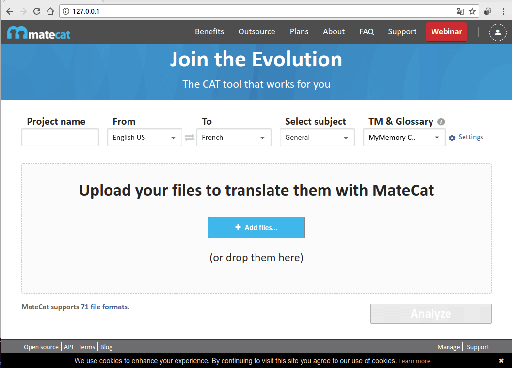
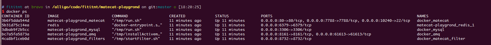
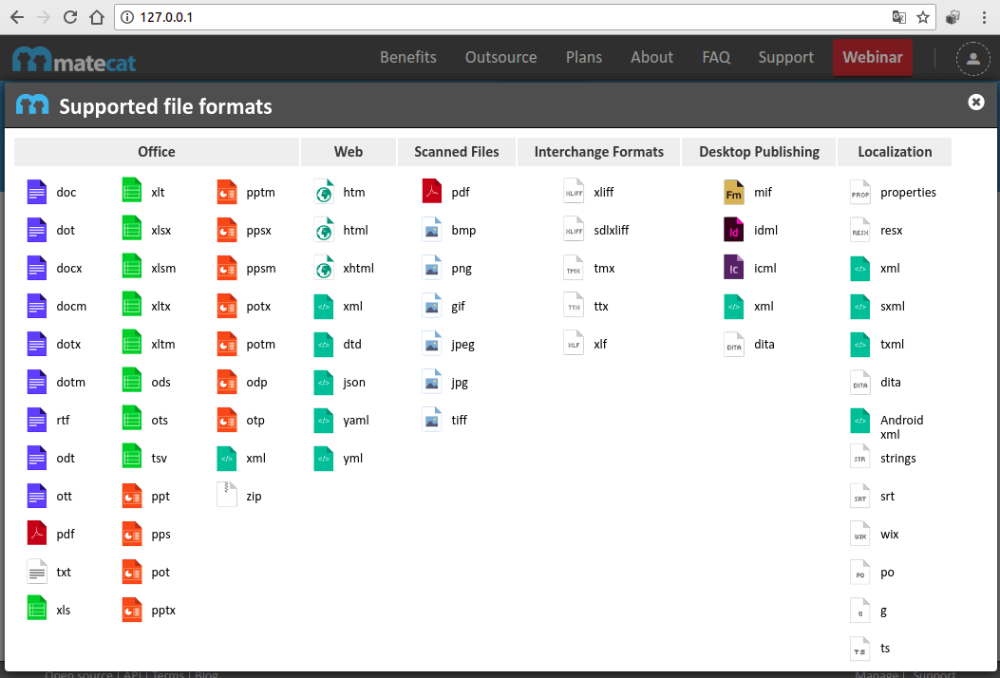

# matecat-playgrond
Rocha's playgrond for [MateCat](https://www.matecat.com/), a _"open source AI
driven translation tool for language industry professionals"_. [See more info](https://github.com/fititnt/internationalization-localization-references/issues/3).

**Protip: use the public site at <https://www.matecat.com/>**. This repository
is just a test based on [Ostico/docker_matecat](https://github.com/Ostico/docker_matecat)
repository.

----




## How reproduce this test

[Docker compose](https://docs.docker.com/compose/) and git are required to run this quicktest.

```sh

# Clone this repository to current folder
git clone git@github.com:fititnt/matecat-playgrond.git .

# Clone Ostico repository
git clone git@github.com:Ostico/docker_matecat.git

# Go to https://github.com/matecat/MateCat and choose a tag, In this example, used v2.2.2b'
git clone -b v2.2.2b --single-branch git@github.com:matecat/MateCat.git

# the docker-compose file from Ostico requires sone unused doors. This command (on Linux) should return nothing
netstat -ntulp | grep -E ':8732|:6379|:61613|:8161|:3306|:80|:7788' 

docker-compose up
```

## Screnshots




